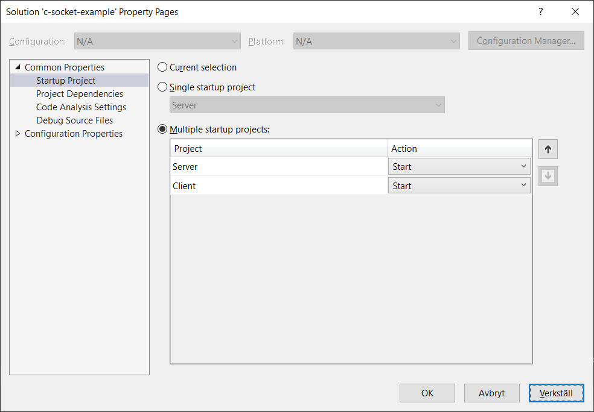

# C Socket example
Server reads file and stores it in a hash table.
Client can connect to server socket and query for values in indata.dat.

# Getting started

* Set solution to multiple startup projects as seen in the image.
* Run with F5.
